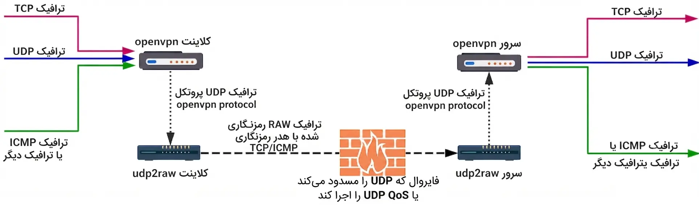

# UDP Tunnel 

<div align="right">


 - اسکریپت راه اندازی تانل بین سرور ایران و خارج
</div>
<div align="left">
 
```
bash <(curl -Ls https://raw.githubusercontent.com/amirmbn/UDP2RAW/main/udp2raw.sh)
```
</div>
<div align="right">


 - شماره 1 مربوط به تنظیمات سرور خارج است
 - شماره 2 مربوط به تنظیمات سرور ایران است
 - گزینه 3 هم برای حذف کامل قوانین و تانل است


تونلی که ترافیک UDP را با استفاده از سوکت خام به ترافیک جعلی TCP/UDP/ICMP رمزگذاری شده تبدیل می‌کند، به شما کمک می‌کند تا از فایروال‌های UDP (یا محیط UDP ناپایدار) عبور کنید.
</div>



